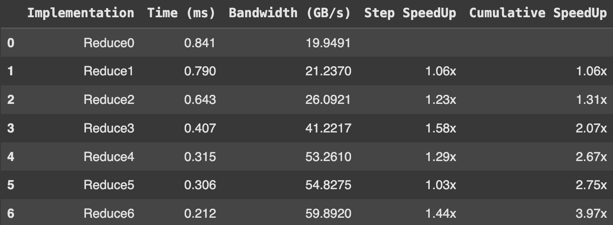
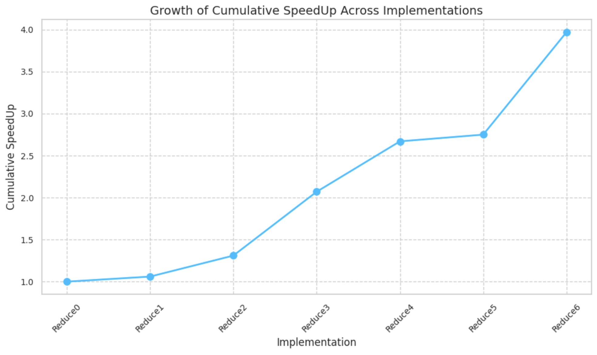
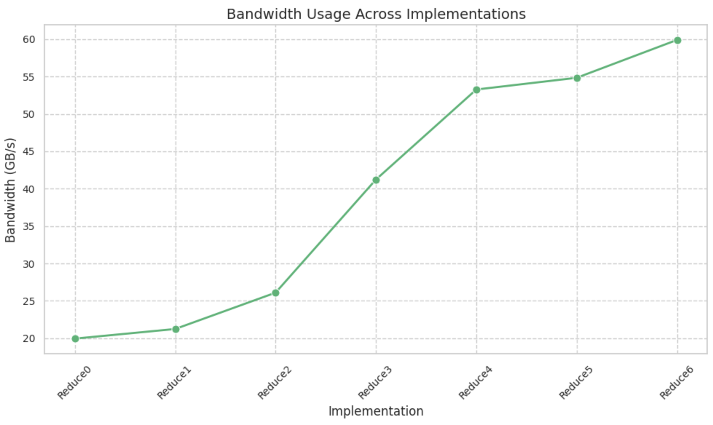

# Parallel-Reduction

This repository contains the CUDA source code for a series of optimized parallel reduction kernels. The focus is on demonstrating 7 optimization strategies for reduction algorithms on GPUs, specifically tailored for NVIDIA GPUs that were outlined by Mark Harris's webinar linked below. 

Source: [NVIDIA Webinar Presentation Slides by Mark Harris](<https://developer.download.nvidia.com/assets/cuda/files/reduction.pdf>)

**List of 7 optimizations:**

0. Interleaved Addressing
1. Interleaved Addressing 2.0
2. Sequence Addressing
3. First Add During Load
4. Unrolling Last Warp
5. Completely Unrolling
6. Multiple Adds / Threads

**Blog Post with a Comprehensive Explanation:**
I have documented the optimization process and provided a detailed analysis of each step in a blog post on Medium. [Check out the post here](<https://medium.com/@rimikadhara/7-step-optimization-of-parallel-reduction-with-cuda-33a3b2feafd8>).

## Results at a Glance

    
    

## Hardware Specifications

- **GPU**: Tesla T4
- **Architecture**: The Tesla T4 is based on the Turing architecture which provides significant improvements over older architectures such as the Tesla architecture used in the GeForce 8800 (GE80) GPUs referenced in the original NVIDIA webinar.

## Experiment Setup

- **Number of Elements**: 4M (4,194,304 elements)
- **Number of Threads per Block**: 256

## Key Differences and Observations

- **Hardware Difference**: The use of the Tesla T4 GPU provides a technological advantage over the GE80 GPU (Tesla Arch) used in the NVIDIA webinar. This newer hardware delivers superior performance characteristics, as evidenced by the more efficient execution in the initial implementations.
  
- **Thread Configuration**: Utilizing 256 threads per block has enabled more granular control over the parallelism, allowing for optimizations that are more closely aligned with the capabilities of the Tesla T4.

- **Performance and Speedup**:
  - Despite the performance improvements in initial tests due to advanced hardware, the relative speedup observed in subsequent optimizations was less pronounced. This is likely due to the already optimized performance of the base case, which leaves less room for dramatic improvements.
  - The speedup is evident, but not as significant as seen in the original webinar. This suggests that the initial performance benefits from using a more advanced GPU may diminish the impact of further algorithmic optimizations.
